Uncaging in HPCA-YFP transfected cells
======================================
*22.01.2021*

Регистрация транслокаций HPCA-TFP после повышения Ca2+.

## Experiment design
*Note: настройки регистраций HPCA-YFP, настройки HPCA-TFP см. dairy 15.11.2020*

### Time Controller protocol
Пробные регистрации - всего 120 фреймов (1 Hz), стимуляция после 20-го фрейма.

### Fluorescent agents:
|Name|Ex.|Em.|Count|
|-|-|-|-|
|EYFP|515 nm|523 nm|-|
|NP-EGTA|405 nm|-|>5 uM|

### Initial parameters
**Optical system**
C.A.: 250 um
Exposure: 2 us/px
Image size: 128x128 px
Zoom: 6
Size: 0.276 um/px

Step size: 1.35 um
Slices: -
Scaning speed: L 1.360 ms, F 0.188 s

**Uncaging**
Laser power (405 nm): 10%
Scaning mode: Tornado
Scaning area diameter: 48 ms
Exposure: 10 us/px
Stimulation time: 100 ms
Cycles: 1

**Laser parameters**
|Laser|Power|Area|Time|
|-|-|-|-|
|515 nm|1%|-|-|
|405 nm|100%|48 ms|0.1 s|

**Channels parameters**
|Ch.|HV (V)|Pass band|Obj.|
|-|-|-|-|
|**CHS1**|575|520-600 nm|HPCA-EYFP|

## Results
Для детекции любых изменений в кадре использован подход расчета абсолютной амплитуды производной картинки без применения маски (модификация ф-ции derivate_frame).
В качестве положительного контроля изменений интенсивности в кадре использованы регистрации HPCA-TFP от 15.11.2020.

### HPCA-TFP registrations
120 frames, 1 frame/sec, stimulation after 5th frame.
Cells 6 and 9.

**Cell 6 binary mask**
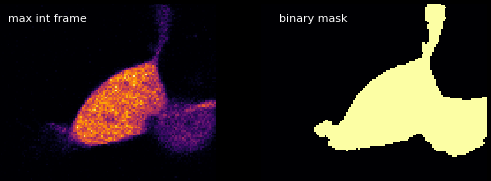

**Cell 6 derivate frame 5**
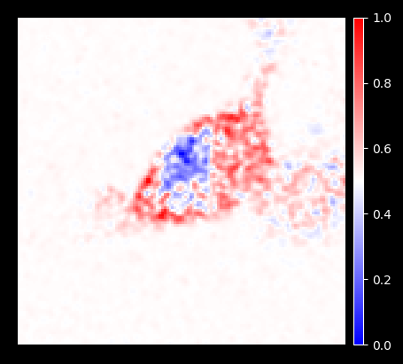
*Maximal translocation frame exactly after stimulation*

**Cell 6 derivate's amplitude plot**
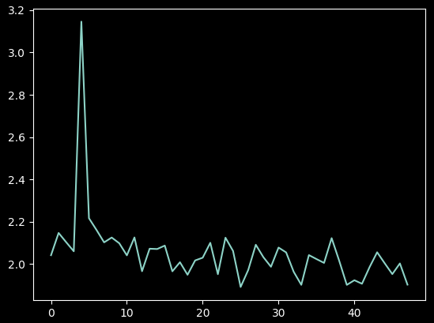

**Cell 9 binary mask**
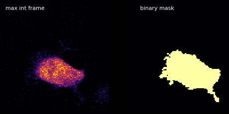

**Cell 9 derivate frame 5**
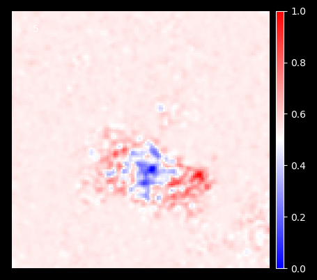
*Maximal translocation frame exactly after stimulation*

**Cell 9 derivate's amplitude plot**
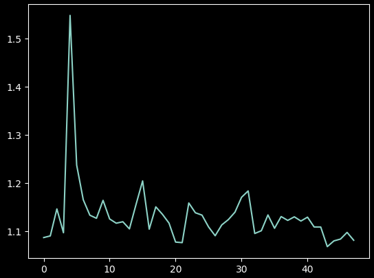

Выраженный пик на пятом фрейме, что совпадает с моментом стимуляции 405 nm. Стимуляция приходилось на ядро, что заметно по снижению его интенсивности в кадре.

### HPCA-YFP registration
Cells 1-4.

#### Cell 1
**Cell 1 binary mask**
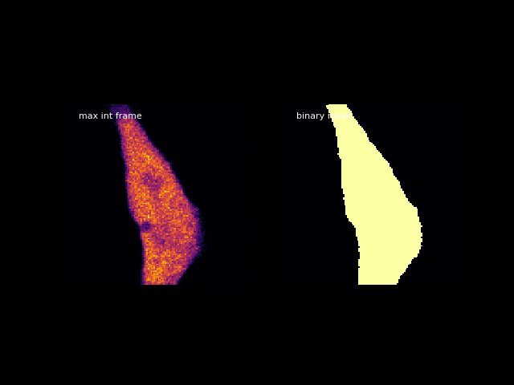

**Cell 1 derivate frame 20**
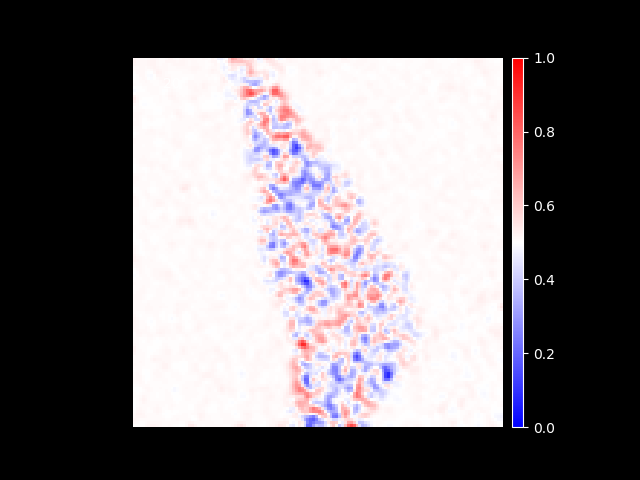
*Maximal translocation frame exactly after stimulation*

**Cell 1 derivate's amplitude plot**
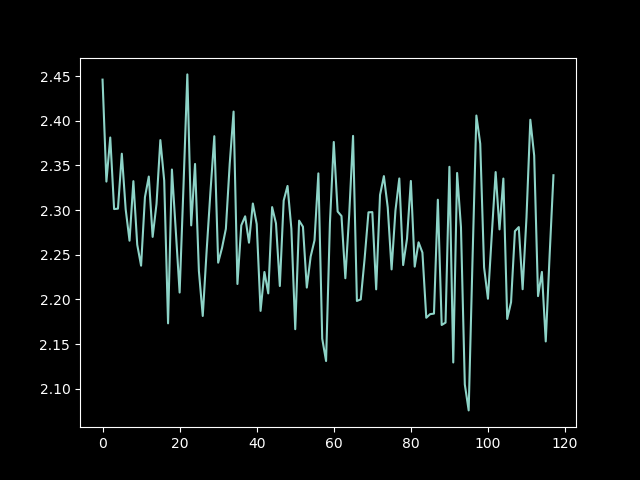

#### Cell 2
**Cell 2 binary mask**
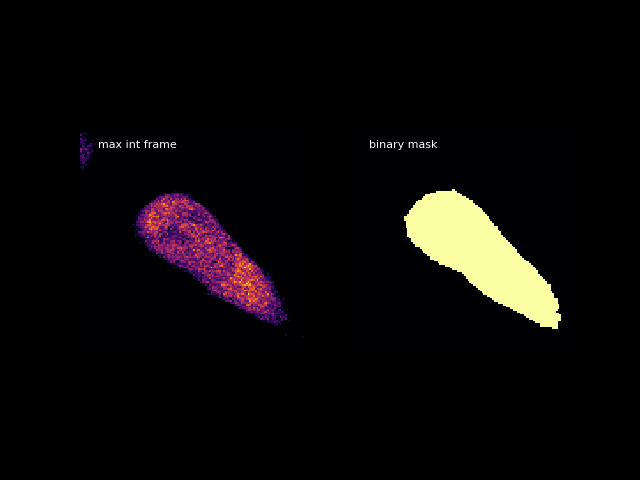

**Cell 2 derivate frame 20**
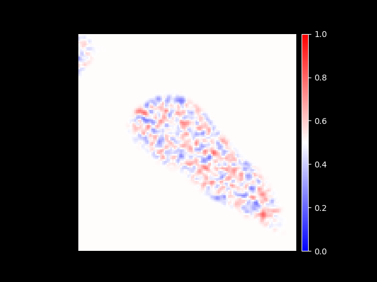
*Maximal translocation frame exactly after stimulation*

**Cell 2 derivate's amplitude plot**
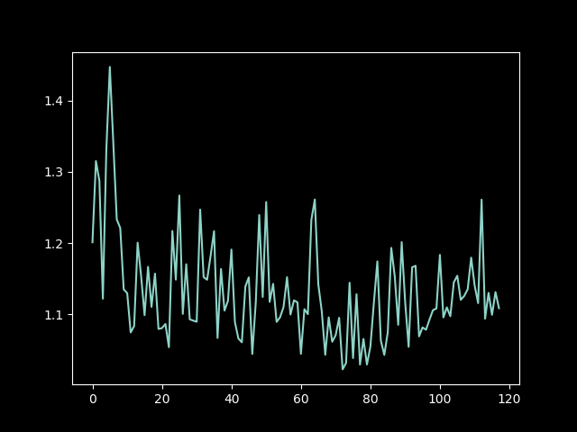

#### Cell 3
**Cell 3 binary mask**
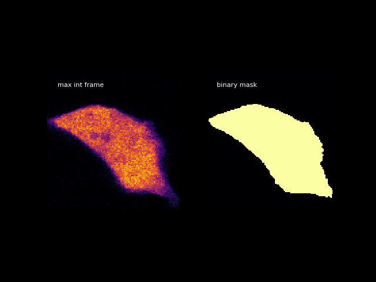

**Cell 3 derivate frame 20**
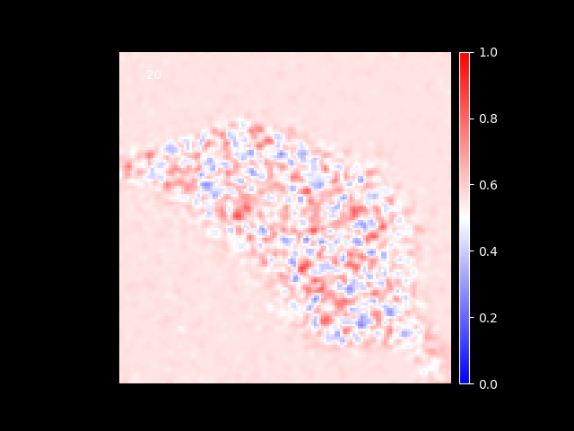
*Maximal translocation frame exactly after stimulation*

**Cell 3 derivate's amplitude plot**
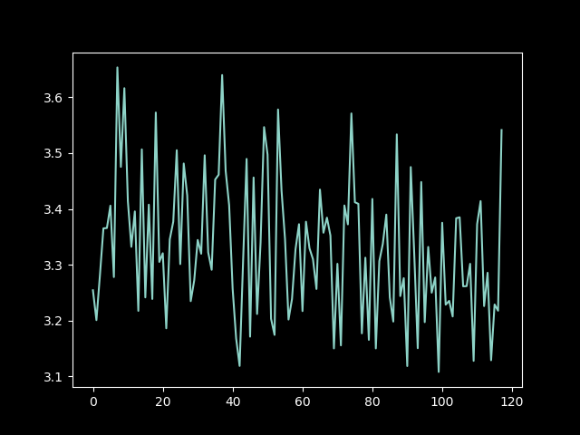

#### Cell 4
**Cell 4 binary mask**
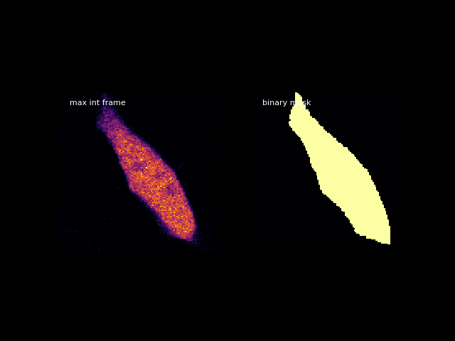

**Cell 4 derivate frame 20**
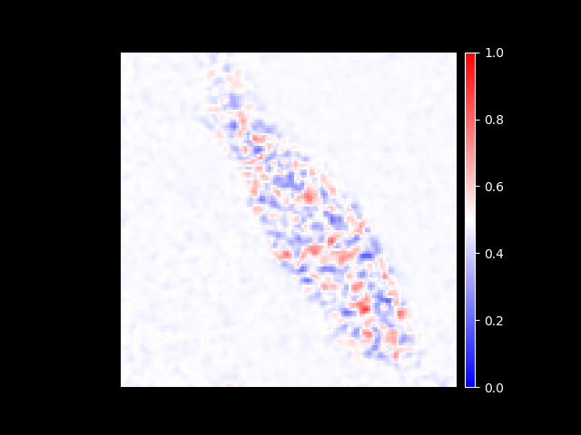
*Maximal translocation frame exactly after stimulation*

**Cell 4 derivate's amplitude plot**
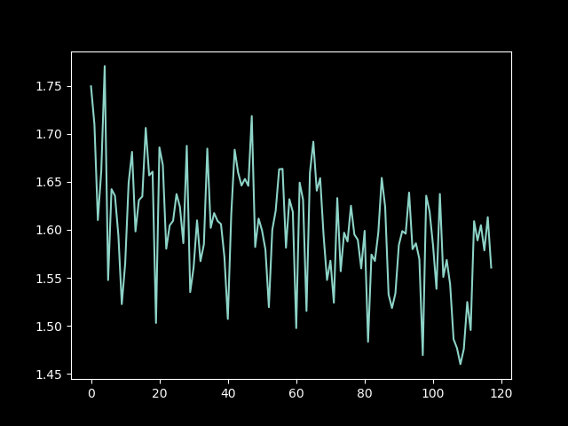

#### Resume
Ожидаемый пик должен быть на двадцатом кадре, однако на всех представленных регистрациях повышение отсутствует.