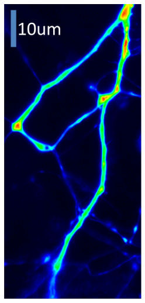
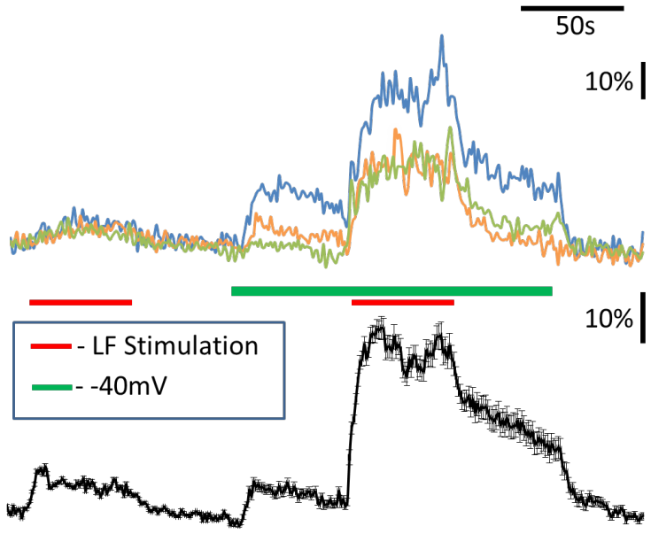
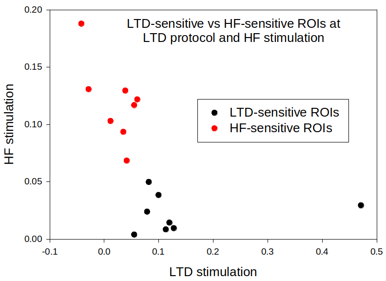

Hippocalcin involvement in NMDAR-dependent LTD of AMPAR-mediated excitatory postsynaptic currents
==============
*Borys Olifirov, 21.06.2021*

**LTD protocol induced Ca2+ influx in different dendrite ROI**

*Dovgan et al. unpub.*

HPCA-FP|Insertions ROI|Insertions
:-:|:-:|:-:
||
*Dovgan et al. unpub.*

**Fig. 3. Two groups of insertions region depending on their answer to the stimulation pattern**

*Dovgan et al. unpub.*

$ SE = \frac{\sigma}{\sqrt{n}} $

Столь явное разделение синапсов на группы, отвечающие только на HFS или только на протокол LTD показывает, что до всякого воздействия на клетку различия уже существуют и изначальные свойства отдельных синапсов влияют на их поведение в ответ на внешние стимулы (Fig. 3). Причиной наличия таких различий могут быть пресинаптические механизмы. Поскольку для развития NMDAR-зависимой LTD необходим продолжительный вход ионов кальция через NMDAR пресинаптические окончания должны быть в состоянии высвобождать медиатор в течении значительного временного отрезка в процессе протокла LTD. 

Быстро реагирующие сайты встраивания $HFs$ $LTDs$ пул готовых к высвобождению везикул (readily releasable pool, $RRP$) и вероятность высвобождения везикул (release propability, $RP$).

В представленной экспериментальной модели LTD в культуре нейронов HPCA выступает не только как объект исследования, но и как удобный зонд, отображающий различия в количестве входящих ионов кальция в окрестностях отдельных синапсов в ответ на одинаковый паттерн внеклеточной стимуляции.

Опираясь на наблюдаемую кластеризацию максимальных амплитуд встраивания HPCA в синапсах можно выдвинуть предположения о минимальных условиях, необходимых на разделение их на "спринтеров" и "марафонцев":

$RRP_{sprinter} \ll RRP_{marathoner}$
$RP_{sprinter} > RP_{marathoner}$

Влияния предыстории активности нейрона на амплитуду встраиваний (При HF или LTD?) говорит о том 

## Main points
- Связан ли паттерн транслокации в окрестностях отдельного синапса с паттерном снижения мембранной концентрации AMPAR?
- Снижение фракции AMPAR на плазматической мембране связно со снижением экзоцитоза или увеличением интернализации AMPAR?
- Как после завершения протокола LTD происходит возврат AMPR в мембрану, становиться ли больше меньше Ca2+-непроводящих субъединиц в составе AMPAR?

## Hypothesis
- **Итоговое снижение амплитуды EPSP формируется за счет равномерного изменения трафика AMPAR в дендритном дереве в составе тех синапсов, которые отвечают на протокол индукции LTD**
  Во всех "марафонцах" наблюдается схожая динамика снижения мембранной фракции AMPAR, "спринтеры" не задействованы/задействованы слабо в этом процессе и окрестности синапсов, которые произведут основной вклад в развитие LTD можно определить уже по паттерну транслокаций при предварительной HF-стимуляции
- **Изменения трафика AMPAR в различных синапсах неравномерны**
- **Кинетика выхода после завершения протокола LTD связана с ассоциацией HPCA с мишенями**
  Если это так, то переход с -40 mV на -70 mV не должен влиять на кинетику выхода, поскольку на -40 mV возможен вход кальция через кальциевые каналы L-типа и переход на -70 mV должен убирать этот вклад.
  При одновременной кальциметрии и регистрации при переходе на -70 mV кинетика выведения кальция должна ускориться, а кинетика выхода HPCA остаться неизменной, что будет говорить о его связи с мишенями на мембране.
- **Не смотря на равномерный вход кальция в окрестностях синапсов, отвечающих на протокол LTD значительными транслокациями временные **

Не смотря на данные о том, что в окрестностях синапсов отвечающих на протокол LTD повышения кальция было равномерным профиль встраивания во времени был различным (есть ли данные по одновременной кальциметрии и транслокациям при LTD?). Это указывает на наличие механизма регуляции не позволяющего HPCA встраиваться простым кальций-зависимым образом и если HPCA непостредсвенно связан с трафиком AMPAR, то и на развитие LTD в обход кальциевым механизмам.

Влияет ли предварительная активность нейрона на профиль встраивания не только при HFS, но и в протоколе развития LTD?