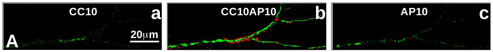

Hippocalcin involvement in NMDAR-dependent long-term postsynaptic plasticity
==============
*Borys Olifirov, 21.06.2021*

## AMPA traffic and plasticity 
Процесс развития NMDAR-зависимой долговременной депрессии (long-term depression/LTD) непосредственно связан со входом ионов кальция через NMDA каналы и уменьшением количества AMPAR на постсинаптической мембране (*Lusher et al., DOI: 10.1109/MTS.2009.931859*), причем если первоначальное снижение проводимости может происходить в следствии увеличения эндоцитоза AMPAR, низкая плотность рецепторов после развития LTD может поддерживаться путем уменьшения экзоцитоза (*Fujii et al., DOI:10.1523/JNEUROSCI.3210-17.2018*).

Обнаружено, что кальций-зависимая транслокация гипокальцина (HPCA) в следствии входа ионов кальция через NMDAR каналы в процессе LFS-протокола индукции LTD неравномерна не только по максимальным амплитудам, но и по профилю встраивания в течении протокола (Fig. 1, *Dovgan, unpub*).

Также наблюдаемая кинетика ухода HPCA с мембраны после индукции LTD значительно медленнее кинетики ухода при высокочастотной стимуляции или единичном кальциевом спайке (Fig. A, *Dovgan, unpub.*, обе ли кривые построены по LTD-чувствительных регионов?)

Единственное исследование связи HPCA с траффиком AMPAR в процессе развития LTD показало прямое взаимодействие HPCA с β2-субъединицей адаптерного протеина 2 (AP2β2), одним из ключевых белков клатрин-опосредованного эндоцитоза. Однако выводы опирались двугибридный анализ взаимодействия N-концевого домена HPCA (2-72) c AP2β2 (*Palmer et al., doi:10.1016/j.neuron.2005.06.014*). Новых работ посвященных взаимосвязи HPCA с трафиком AMPAR, а тем более в физиологических условиях, найдено не было.

**Fig 1. Variability of HPCA spatio-temporal translocation profiles during LFS-induced LTD protocol**
HPCA-FP|Insertions ROI|Insertions
:-:|:-:|:-:
||
*Dovgan et al. unpub.*

В представленной экспериментальной модели LTD в культуре нейронов HPCA выступает не только как объект исследования, но и как удобный зонд, отображающий различия в количестве входящих ионов кальция в окрестностях отдельных синапсов в ответ на одинаковый паттерн внеклеточной стимуляции.

### Questions
- Связан ли паттерн транслокации HPCA в окрестностях отдельного синапса с паттерном снижения количества AMPAR в постсинапческой мембране?
- Транслокация HPCA в процессе индукции LTD связана с усилением эндоцитоза AMPAR?
- Как меняется трафик AMPAR после окончание протокола индукции LTD, в процессе постепенного ухода HPCA c мембраны?
- Как после завершения протокола LTD происходит возврат AMPR в мембрану, как меняется субъединичный состав рецепторов?
- Влияют ли мутации в мембран-связывающем регионе HPCA на трафик AMPAR  в процессе индукции LTD?
- Имеет ли место непосредственное взаимодействие HPCA и AP2β2 в процессе индукции LTD?
- Имеет ли место непосредственное буферизация клатрина HPCA и его кальций-зависимое высвобождение?
- Замедленная кинетика ухода HPCA с мембраны после протокола индукции LTD связана с его ассоциацией с мембранными мишенями или является артефактом FDP протокола индукции LTD (удержание мембранного потенциала на уровне -40 mV приводит к частичной активации L-каналов и входу кальция)?

## Hippocalcin behavior in FDP-type LTD and STDP-type LTD
Ранее использованный протокол индукции LTD подразумевает использование частотно-зависимой пластичности (frequency-depend plasticity) - низкочастотную стимуляцию (low frequency stimulation/LFS) пресинаптических входов (1 Hz 5-15') и в таком случае основным источником входа ионов кальция выступают NMDAR и AMPAR не содержащие GluA2-субъединицу. Продолжительный локальный вход кальция и медленная кинетика выхода HPCA из мембраны позволяет кальциевому сенсору накапливаться в незначительных по площади областях в окрестности исключительно активных синапсов (Fig. 4).

**Fig. 4. LTD-induced local HPCA translocation**

*Dovgan et al. unpub.*

Продолжительность одного кальциевого спайка вызванного внеклеточной стимуляцией составляет 400-500 ms и моделирование показало что при низкочастной стимуляции уровень кальция успевает снижаться до исходных значений (*Melanie et al., doi:10.1371/journal.pone.0043810*), однако медленная кинетика выхода HPCA из мембраны позволяет ему эффективно интегрировать подобный сигнал (*Dovgan et al, doi:10.1111/j.1460-9568.2010.07303.x*), что может быть свидетельством в пользу регуляции LTD посредством HPCA по механизму продолжительности кальциевого транзиента, а не его амплитуды (*Evans and Blackwell*).

Однако экспериментальные данные показывают, что в течении всего FDP протокола индукции LTD концентрация ионов кальция в дендритных шипиках поднимается равномерно (*Dovgan, unpub.*).

Постсинаптическая активность провоцирует открытие потенциал-зависимых кальциевых каналов и диффузный вход ионов кальция, и одновременная пресинаптическая стимуляция обеспечивающая как дополнительный локальный вход кальция, так и дополнительную деполяризацию может приводить к диффузной транслокации в значительных регионах дендрита (Fig. 5).

**Fig. 5. Associativity of HPCA translocation in dendritic shaft**

*Dovgan et al. unpub.*

Spike-timing dependent plasticity (STDP)-протокол индукции синаптической пластичности, в основе которого лежат парная стимуляция пре- и постсинапса с незначительной временной задержкой (50-100 пар импульсов с частотой 100 Hz, *Poo and Bi, doi.org/10.1523/JNEUROSCI.18-24-10464.1998*) может также провоцировать диффузный вход ионов кальция различной амплитуды (Fig. 6). Как следствие, транслокацию HPCA не только в областях активных синапсов и снижать максимальную амплитуду транслокаций. Роль гипокальцина в развитии NMDAR-зависимой LTD при таком протоколе индукции пока неизвестна. И потенциально за столь различными паттернами входа ионов кальция могут скрываться два разных механизма индукции LTD.

**Fig. 6. Postsynaptic calcium dynamics evoked FDP protocol (simulation)**

*Melanie et al. 2012*

**Fig. 7. Experimental postsynaptic calcium dynamics evoked LDT protocol, 1 Hz 300'**

*Dovgan et al. unpub.*

**Fig. 7. Postsynaptic calcium dynamics evoked STDP protocol (simulation)**

*Graupner et al. 2007*

## Presynapse characteristics influence to HPCA translocation pattern and amplitude
Интересно, что встраивание HPCA в ответ на протокол индукции LTD происходило не во всех наблюдаемых в процессе эксперимента синапсах. Более того, наблюдается кластеризация значений максимальных амплитуд встраивания на группы которые отвечали на высокочастотную стимуляцию (HFSs/high frequency stimulation - sensitive) и протокол индукции LTD (LTDs/long term depression protocol stimulation - sensitive).

Опираясь на наблюдаемую кластеризацию максимальных амплитуд встраивания HPCA в синапсах можно выдвинуть предположения о минимальных условиях, необходимых для разделение на кластеры которые были бы связаны с пресинаптическими характеристиками: пулом готовых к высвобождению везикул (readily releasable pool, $RRP$) и вероятностью высвобождения везикул (release propability, $RP$).

**Fig. 2. Two groups of insertions region depending on their answer to the stimulation pattern**

*Dovgan et al. unpub.*

Можно предположить, что HFSs способны эффективно отвечать на стимуляцию высвобождением медиатора, но быстро истощающих свои запасы. В то же время LTDs до протокола индукции LTD обладал незначительной силой однако способны высвобождать медиатор в течении всего протокола. Исходя из этого условия разделения на группы:

$RRP_{HFSs} \ll RRP_{LTDs}$
$RP_{HFSs} > RP_{LTDs}$

## Hippocalcin biophysical properties and their role in presynapse plasticity

Одновременно с этим данные регистрации встраивания мутантной формы HPCA (N75K) показывают снижение площади областей транслокации белка (Fig. 3) и неизвестно, коррелирует ли это с трафика AMPAR или изменение амплитуды токов в LTD неизвестно.

**Fig. 3. Loss of function of N75K mutant during LTD induction protocol**

*Dovgan et al. unpub.*

Мутация в позиции N75K находиться в сайте связывания иона кальция и показано, что она одновременно снижает аффиность и буферную емкость HPCA (*Osypenko et al., doi.org/10.1016/j.nbd.2019.104529*). Поскольку HPCA является ведущим кальциевым буфером в нейронах гиппокампа (*Furuta et al., DOI:10.1023/A:1021000425070*) даже незначительное изменение его биофизических свойств может значительно повлиять на всю внутреннюю кальциевую регуляцию, в том числе на CaMKII-зависимый механизм индукции LTP.

## Questions 
1. Связан ли паттерн транслокации в окрестностях отдельного синапса с паттерном снижения мембранной концентрации AMPAR?
2. Снижение фракции AMPAR на плазматической мембране связно со снижением экзоцитоза или увеличением интернализации AMPAR?
3. Как после завершения протокола LTD происходит возврат AMPR в мембрану, как меняется субъединичный состав рецепторов?
4. Меняется ли характер ухода AMPAR в течении протокола LTD в присутствии мутанта N75K?
5. Есть ли разница между максимальными амплитудами LTP в синапсах с HFSs сайтами транслокации и LTDs чувствительными сайтами транслокаций?
6. Есть ли разница в паттерне транслокаций и амплитуд тока в ответ на классический протокол индукции LTD и STDP-протокол?

## Hypothesis
- **Итоговое снижение амплитуды EPSP формируется за счет равномерного изменения трафика AMPAR в дендритном дереве в составе тех синапсов, которые отвечают на протокол индукции LTD**
  Во всех "марафонцах" наблюдается схожая динамика снижения мембранной фракции AMPAR, "спринтеры" не задействованы/задействованы слабо в этом процессе и окрестности синапсов, которые произведут основной вклад в развитие LTD можно определить уже по паттерну транслокаций при предварительной HF-стимуляции
- **Изменения трафика AMPAR в различных синапсах неравномерны, вариации RRP и RP континуальны внутри группы синапсов отвечающих на протокол индукции LTD**
- **Кинетика выхода после завершения протокола LTD связана с ассоциацией HPCA с мишенями**
  Если это так, то переход с -40 mV на -70 mV не должен влиять на кинетику выхода, поскольку на -40 mV возможен вход кальция через кальциевые каналы L-типа и переход на -70 mV должен убирать этот вклад.
  При одновременной кальциметрии и регистрации при переходе на -70 mV кинетика выведения кальция должна ускориться, а кинетика выхода HPCA остаться неизменной, что будет говорить о его связи с мишенями на мембране.
